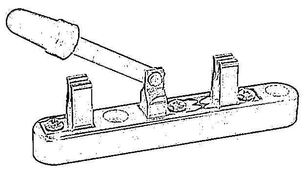

# Elektronische componenten

Hier vind je uitleg over de belangrijkste basiscomponenten die we nodig hebben bij het gebruik van microcontrollers of om de werking te beschrijven.

## DC Spanningsbron

**Symbool:** 

De spanningsbron is de voeding voor je microcontroller. Dit kan een batterij zijn, een adapter of de USB-poort van je computer.

## Diode

**Symbool:** 

Een diode laat stroom maar in één richting door. Zoals het in dit symbool staat, kan de stroom van boven naar onder stromen maar niet omgekeerd.

## LED (Light Emitting Diode)

**Symbool:** 

Een LED is een speciale diode, ze geeft licht als er voldoende stroom doorheen gaat. Gebruik altijd een serieweerstand om ervoor te zorgen dat er niet te veel stroom doorheen vloeit! Dan kan de LED of de uitgang van de microcontroller immers kapot gaan.

## Weerstand

**Symbool:** 

Een weerstand beperkt de stroom in een circuit. Dit hebben we bijvoorbeeld nodig bij het aansluiten van een LED!

<!--
## Serieweerstand bij LED

- **Schema:** 

De serieweerstand voorkomt dat de LED kapot gaat door te veel stroom.
-->

## Zekering (Fuse)

 **Symbool:** 

Een zekering beschermt tegen te hoge stroom. Wanneer de stroom te groot wordt, zal de zekering gecontrolleerd doorbranden. Let op: een zekering is geen weerstand, vele leerlingen tekenen een weerstand met het symbool van een zekering maar dat is helemaal verkeerd!

## Schakelaar (SPDT)

- **Afbeelding:** 
- **Symbool:** 

Met een SPDT (Single Pole Dual Throw) schakelaar of tuimelschakelaar, kan je kiezen of hoe "middelste" contact verbonden wordt. In het model op de foto, kan je zorgen dat het met geen van beiden contact maakt maar dit kan meestal niet. Het is ofwel verbonden met het ene, ofwel met het andere en daar zit slechts een zeer korte *"dode tijd"* tussen. Deze schakelaar komt later terug bij **output**.

## Microcontroller

 **Symbool:** 

Dit is het symbool van de ATmega328-p. Deze microcontroller wordt ondermeer gebruikt op de **Arduino UNO R3**.

Zoals je ziet, is het symbool eerder simpel, een rechthoek met veel aansluitingen. Dit is vaak het geval bij complexere componenten. Je zal merken dat *de grond* (GND of 0V) vaak onderaan staat en de *voedingsspanning* (VCC) in de regel bovenaan. Ook zullen *inputs* vaak links staan en *outputs* rechts. Hier komen we later nog terug, wanneer we beter weten wat *in- en outputs* zijn. De signaal namen staan in de rechthoek terwijl de pin nummers buiten de rechthoek, naast de pinnen genoteerd staan.

## Microcontroller bord

 **Symbool:** 

Dit is het symbool van het microcontroller bord **Arduino UNO R3**. Zoals je kan zien, lijkt het heel erg op een symbool van de microcontroller maar het is niet helemaal hetzelfde. Een **microcontroller** is een component terwijl er op een **microcontroller *bord*** meerdere componenten staan, waaronder de microcontroller zelf. Van deze extra componenten maken we abstractie (we tekenen ze niet). Enkel de pinnen waarmee we het bord verbinden, worden in het symbool getekend.

## Schema's

We gebruiken deze symbolen om schema's te tekenen, zodat we duidelijk kunnen maken hoe de componenten aangesloten worden. Je vind heel veel informatie over microcontroller borden zoals de Arduino. Soms vind je een tekening zoals hieronder die duidelijk maken hoe een Arduino aan een ander bord of component aangesloten moet worden.

   **Tekening:** 

Deze tekening komt van de instructables.com website [Bron: instructables.com](https://www.instructables.com/How-to-Use-the-Adafruit-BMP280-Sensor-Arduino-Tuto/) en toont hoe een BMP280 module die temperatuur en luchtdruk kan meten, via een breadbord aangesloten wordt aan een Arduino R3. Deze tekening geeft een beschrijving van de aansluitingen maar het is **geen schema**. De verschillende onderdelen worden grafisch voorgesteld en **niet** in een **symbool**. Dit werkt voor kleine, gemakkelijke schakelingen maar het werkt niet zo goed voor grotere of complexere circuits. Als we hetzelfde circuit schematisch willen voorstellen, kan het er bijvoord zo uit zien:
 **Schema:** 