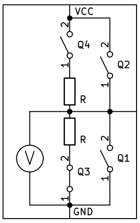

# GPIO – General Purpose Input/Output

**GPIO** staat voor **General Purpose Input/Output**. Dit zijn de **pinnen** op een microcontroller die je kunt instellen om ze te **gebruiken** als **input** (iets meten) **of output** (iets aansturen).

- GPIO als output: bijvoorbeeld een LED aan/uit zetten.
- GPIO als input: bijvoorbeeld een knop uitlezen.

GPIO is de brug tussen de concepten input/output en de echte hardware. We kunnen een *vereenvoudigde* GPIO schematisch zo voorstellen:


Dit is de **standaard configuratie** van een **GPIO**. Tenzij we de configuratie van een pin veranderen, is de GPIO zoals hierboven geconfigureerd. Alle **"inwendige schakelaars"** zijn open dus de GPIO gedraagt zich als een **input**.

## GPIO in "input" mode

In **C++** kunnen we de status van een ingang lezen door middel van het pin nummer (`digitalRead(<pin_nummer>)`). Als een bepaalde GPIO altijd als *input* gebruikt gaat worden, moet je dit dus niet specifiek instellen. Maar als tijdens je programma de GPIO in een andere mode gebruikt hebt en je wil hem terug als ingang instellen, kan dat op deze manier:

```cpp
// cpp
pinMode(14, INPUT);  // zet pin 14 in INPUT mode
```
In **MicroPython** gaat het een beetje anders. In het deel over de **output** en **input**, zagen we dat we moeten aangeven waarvoor een pin gebruikt wordt en dat je die dan pas kunt gebruiken. Hier gaan we eindelijk zien hoe dat moet gebeuren.

Een verschil tussen **Arduino** en **MicroPython** is dat bij **Arduino** de *bibliotheken* die nodig zijn om een GPIO te gebruiken, standaart toegangkelijk zijn. In **MicroPython** moet je de bibliotheek bovenaan je code aanroepen. Dat gebeurt zo:
``` python
# MicroPython
from machine import Pin
```
Als dit bovenaan in de code staat, kan je in je verdere code GPIO's *configureren* (is in de gewenste mode zetten) en gebruiken. Het *configureren* als input gaat dan zo:

``` python
# MicroPython

# Pin 14 als gewone input
button = Pin(14, Pin.IN)
```
Eigenlijk lijkt in **MicroPython** een GPIO op een **object** dat eigenschappen heeft. We gaan de details hiervan later nog bekijken maar het komt er voorlopig op neer dat je de GPIO een betekenisvolle naam geeft. 

``` python
# MicroPython

# De input waarde inlezen
waarde = button.value()
```

## GPIO in "input-pull-up" mode

We zetten onze *vereenvoudigde* GPIO in *input-pull-up* mode door *schakelaar* **Q4** te sluiten:


In **C++** stellen we de GPIO opnieuw met **pinMode** in:

```cpp
// cpp
pinMode(14, INPUT_PULLUP);  // zet pin 14 in INPUT-PULLUP mode
```
Ook in **MicroPython** gebeurt het op een gelijkaardige manier, alleen komt er nu een *argument* (tussen de haakjes) bij. Het is alsof we zeggen dat de GPIO een *input* is **en** dat de *pull-up weerstand* moet aangezet worden.
``` python
# MicroPython

# Pin 14 als input met pull-up weerstand 
button = Pin(14, Pin.IN, Pin.PULL_UP)  
```
## GPIO in "input-pull-down" mode

**Niet alle microcontrollers** hebben deze mogelijkheid. Bijvoorbeeld de veelgebruikte **Arduino UNO r3** heeft geen interne pull-down weerstanden. Daarmee is deze optie niet beschikbaar. In de praktijk worden **pull-up weerstanden** veel vaker gebruikt dan **pull-down weerstanden**, dus het is vaak geen probleem. Voor de microcontrollers die het wel hebben, zoals de **ESP-32**, beschrijven we deze **pull-down** mode.

We zetten onze *vereenvoudigde* GPIO in *input-pull-down* mode door *schakelaar* **Q3** te sluiten:



In **C++** stellen we de GPIO opnieuw met **pinMode** in:

```cpp
// cpp
pinMode(14, INPUT_PULLDOWN);  // zet pin 14 in INPUT-PULLDOWN mode
```
Ook in **MicroPython** gebeurt het op een gelijkaardige manier als bij de pull-up mode.

``` python
# MicroPython

# Pin 14 als input met pull-down weerstand  
button = Pin(14, Pin.IN, Pin.PULL_DOWN)
```
## GPIO in "output" mode

Wanneer we de GPIO in output mode zetten, wordt de pin verbonden met **GND** of **VCC**. Hoe we dat doen, hadden we al in het hoofdstuk van de **output** gezien. Schematisch ziet het er eigenlijk wel iets anders uit dan met de "interne SPDT" schakelaar, al is de werking compleet hetzelfde. De 2 mogelijkheden in output mode zijn deze:

**OUTPUT-mode, LAAG**


Dit wordt gedaan door alleen de *inwendige schakelaar* Q1 te sluiten. De GPIO pin wordt intern met GND verbonden.

**OUTPUT-mode, HOOG**


Dit wordt gedaan door alleen de *inwendige schakelaar* Q2 te sluiten. De GPIO pin wordt intern met VCC verbonden.

Een GPIO in **C++** in output-mode te zetten, doen we zo:

```cpp
// cpp
pinMode(12, OUTPUT);  // zet pin 12 in OUTPUT mode
```
In **MicroPython** doen we het zo:

```python
# MicroPython
from machine import Pin

# Pin 12 als output
led = Pin(12, Pin.OUT)
```
---

## Samenvatting: GPIO configureren

### C++ (Arduino)

| Mode | Instructie | Gebruik |
|------|------------|---------|
| **Input** | `pinMode(pin, INPUT);` | Gewone ingang, externe pull-up/down nodig |
| **Input Pull-up** | `pinMode(pin, INPUT_PULLUP);` | Ingang met interne pull-up weerstand |
| **Input Pull-down** | `pinMode(pin, INPUT_PULLDOWN);` | Ingang met interne pull-down weerstand* |
| **Output** | `pinMode(pin, OUTPUT);` | Uitgang (hoog/laag) |

*Niet beschikbaar op alle microcontrollers (bv. Arduino UNO r3)

**Waarden lezen/schrijven:**
```cpp
// Lezen
bool waarde = digitalRead(pin);

// Schrijven  
digitalWrite(pin, HIGH);  // of LOW
```
### MicroPython

| Mode | Instructie | Gebruik |
|------|------------|---------|
| **Input** | `pin = Pin(nummer, Pin.IN)` | Gewone ingang, externe pull-up/down nodig |
| **Input Pull-up** | `pin = Pin(nummer, Pin.IN, Pin.PULL_UP)` | Ingang met interne pull-up weerstand |
| **Input Pull-down** | `pin = Pin(nummer, Pin.IN, Pin.PULL_DOWN)` | Ingang met interne pull-down weerstand |
| **Output** | `pin = Pin(nummer, Pin.OUT)` | Uitgang (hoog/laag) |

**Vergeet niet de bibliotheek te importeren:**
```python
from machine import Pin
```
**Waarden lezen/schrijven:**
```python
# Lezen
waarde = pin.value()

# Schrijven
pin.value(1)    # of 0, True, False
```

