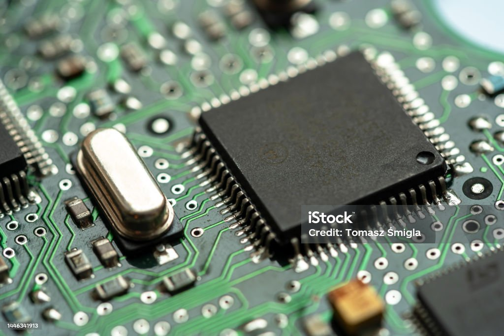

# Welkom bij de cursus Microcontrollers

Deze website helpt je om microcontrollers te leren programmeren. In deze cursus bekijken we hoe dat kan met Arduino (C++) en met MicroPython. Kies een hoofdstuk in de inhoudstabel om te starten!

