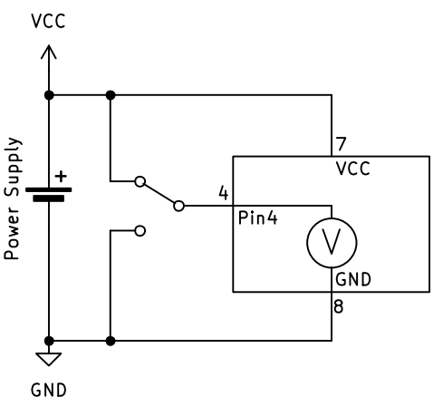
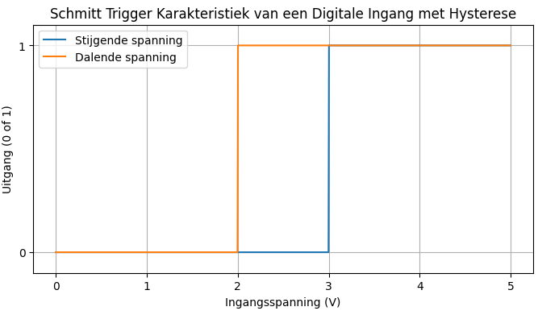

# Input – Dingen meten

Input betekent dat de microcontroller informatie ontvangt uit de buitenwereld. Dit kan bijvoorbeeld een knop, een sensor of een schakelaar zijn.

## Het concept van digitale input

Stel je voor dat je een heel **eenvoudige voltmeter** hebt die maar twee waarden kan weergeven:
- **True** (waar) = er staat spanning op de ingang
- **False** (onwaar) = er staat geen spanning op de ingang

Deze voltmeter kan dus alleen maar **ja** of **nee** antwoorden op de vraag: "Is er spanning?"

Zo werkt digitale input ook: de microcontroller meet of er spanning staat op een pin en geeft als antwoord een **boolean** terug.

## Voorbeelden van digitale input

- **Knop indrukken**: 
  - Knop ingedrukt = True (spanning aanwezig)
  - Knop niet ingedrukt = False (geen spanning)

- **Schakelaar**:
  - Schakelaar aan = True 
  - Schakelaar uit = False

- **Eenvoudige sensor**:
  - Object gedetecteerd = True
  - Geen object = False

## Schema-voorstelling

Net zoals bij output kunnen we dit voorstellen in een schema:

> De microcontroller werkt als een digitale voltmeter: hij meet alleen of er wel of geen spanning staat, niet hoeveel spanning er precies is.

## Extra: Schmitt Trigger - waarom niet gewoon bij 2,5V omschakelen?

Je zou denken: "Waarom schakelt de microcontroller niet gewoon om bij 2,5V (de helft van 5V)?"  
Het probleem is dat spanningen kunnen **trillen** of **ruis** kunnen hebben. Als de spanning heel langzaam stijgt of daalt rond 2,5V, zou de uitgang heel vaak kunnen omschakelen tussen 0 en 1.

**Oplossing: De Schmitt Trigger**  
Een microcontroller gebruikt daarom een **Schmitt Trigger**. Dit betekent:
- Bij **stijgende** spanning schakelt hij om van 0 naar 1 bij bijvoorbeeld **3,0V**
- Bij **dalende** spanning schakelt hij om van 1 naar 0 bij bijvoorbeeld **2,0V**

Deze **verschillende** drempelwaardes maken het systeem **stabieler** en voorkomen ongewenste schakelingen door ruis.

> Dit heet **hysterese** (of *hysteresis* in het Engels) - een slim trucje om storing te voorkomen!

## Van concept naar praktijk

In de praktijk gebeurt digitale input vaak via een **GPIO-pin** van de microcontroller. Hoe je dit precies programmeert in **C++** en **MicroPython**, leer je in het hoofdstuk over GPIO.

---

*Lees verder op de pagina ['GPIO'](gpio.md) hoe je dit met een microcontroller doet.*