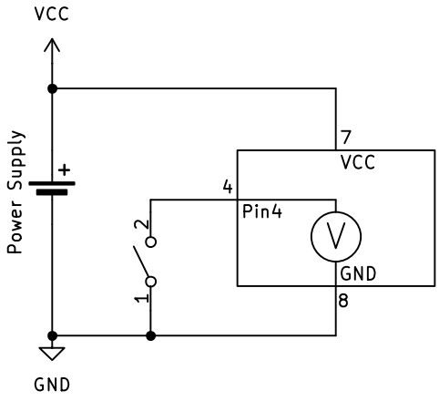
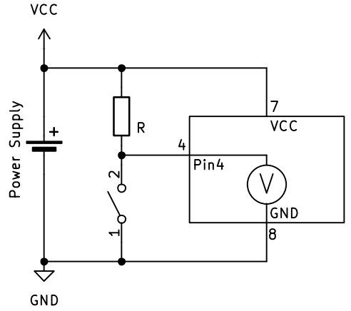
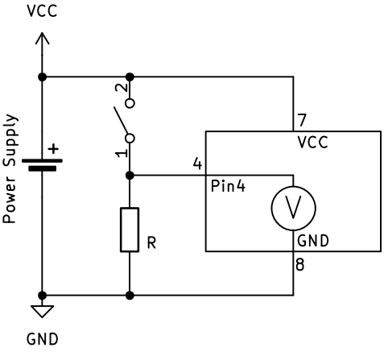
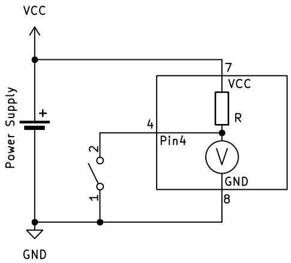
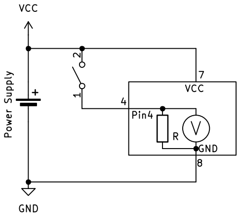

# Input – Dingen meten

Input betekent dat de microcontroller informatie ontvangt uit *de buitenwereld*. Dit kan bijvoorbeeld een knop, een sensor of een schakelaar zijn.

## Het concept van digitale input

Stel je voor dat je een heel **eenvoudige voltmeter** hebt die maar twee waarden kan weergeven:

- **True** (waar) = er staat spanning op de ingang
- **False** (onwaar) = er staat geen spanning op de ingang

Deze voltmeter kan dus alleen maar **ja** of **nee** antwoorden op de vraag: "Is er spanning?"

Zo werkt digitale input ook: de microcontroller meet of er spanning staat op een pin en geeft als antwoord een **boolean** terug.

## Voorbeelden van digitale input

1. **Drukknop indrukken**:  

    - Knop ingedrukt = True (spanning aanwezig)
    - Knop niet ingedrukt = False (geen spanning)

2. **Schakelaar**:

    - Schakelaar aan = True  
    - Schakelaar uit = False

3. **Eenvoudige sensor**:

    - Object gedetecteerd = True
    - Geen object = False

## Schema-voorstelling

Net zoals bij **output** kunnen we dit voorstellen in een **schema**:


> De microcontroller werkt als een ***digitale* voltmeter**: hij meet alleen of er **wel** of **geen** spanning staat, niet *hoeveel* spanning er precies is.

## Input lezen in code

### In C++ (Arduino)

In **C++** lees je een digitale ingang uit met de functie `digitalRead()`:

```cpp
// cpp
bool knopStatus = digitalRead(4);  // Lees pin 4 uit
```

Je krijgt dan `HIGH` (of `true`) terug als er spanning op de pin staat, of `LOW` (of `false`) als er geen spanning staat.

> Opmerking, in het bovenstaande voorbeeld wordt er een variabele **knopStatus** aangemaakt om de waarde van *digitalRead* in op te vangen. Wanneer die variabele reeds bestaat in het programma, is het datatype `bool` in het begin van de lijn niet meer nodig.

### In MicroPython

In **MicroPython** ziet het er opnieuw net iets anders uit. Daar moeten we eerst aangeven dat *knop* aan pin 4 is aangesloten. *Hoe* dat moet, volgt later. Je leest een digitale ingang uit met de *methode* `.value()`:

```python
# MicroPython
knop_status = knop.value()  # Lees de knop uit
```

Je krijgt dan `1` (of `True`) terug als er spanning op de pin staat, of `0` (of `False`) als er geen spanning staat.

## Schmitt Trigger - waarom niet gewoon bij 2,5V omschakelen?

Je zou denken: "Waarom schakelt de microcontroller niet gewoon om bij 2,5V (de helft van 5V)?"  
Het probleem is dat spanningen kunnen **trillen** of **ruis** kunnen hebben. Als de spanning heel langzaam stijgt of daalt rond 2,5V, zou de uitgang heel vaak kunnen omschakelen tussen 0 en 1.

**Oplossing: De Schmitt Trigger**  
Een microcontroller gebruikt daarom een **Schmitt Trigger**. Dit betekent:

- Bij **stijgende** spanning schakelt hij om van 0 naar 1 bij bijvoorbeeld **3,0V**
  
- Bij **dalende** spanning schakelt hij om van 1 naar 0 bij bijvoorbeeld **2,0V**


Deze **verschillende** drempelwaardes maken het systeem **stabieler** en voorkomen ongewenste schakelingen door ruis.

> Dit heet **hysterese** (of *hysteresis* in het Engels) - een slim trucje om storing te voorkomen!

## Drukknopschakelaars

In de bovenstaande uitleg sloten we een **wisselschakelaar** (of SPDT schakelaar) aan op de **ingang** van de microcontroller. Ondanks dat dit perfect werkt, gaan we dit in de praktijk niet veel zien. De meeste **drukknopschakelaars** hebben slechts **2 contacten** en deze zijn ***open*** wanneer er niet op gedrukt wordt en ***gesloten*** wanneer er op gedrukt wordt. Om dit type schakelaar aan te sluiten, moeten we het circuit een beetje uitbreiden. Dit is dan ook de reden waarom we de uitleg van de input aanvankelijk met een ander type schakelaar hebben gedaan, zodat het circuit eenvoudiger en dus begrijpbaarder is.

Wanneer we de wisselschakelaar vervangen door een *normaal-open* (of SPST) schakelaar, ziet het schema er bijvoorbeeld zo uit:



De schakeling zoals hierboven afgebeeld, zal niet werken; de interne voltmeter kan geen verschil detecteren tussen wanneer de schakelaar ingedrukt (gesloten) is en wanneer hij niet ingedrukt (open) is. Om het circuit wel te laten werken, voegen we een weerstand toe die de spanning "naar boven" trekt wanneer de schakelaar open is. Dit noemen we een **pull-up** weerstand.



Let op: de spanning is **hoog** wanneer de drukknopschakelaar **niet ingedrukt** is en **laag** wanneer hij **ingedrukt** is. Dit is dan ook een **actief laag** signaal.

---
We kunnen de drukknopschakelaar en de weerstand omdraaien om er een **actief hoog** signaal van te maken:



### Weerstandswaarde

De **waarde** van de pull-up of pull-down **weerstand** is niet zo kritisch. Meestal wordt een weerstand met een waarde **tussen 10kΩ en 100kΩ** gebruikt. Wanneer de waarde lager dan 10kΩ is, loopt er meer stroom dan nodig door de weerstand wanneer de drukknopschakelaar ingedrukt wordt. Wanneer de waarde te hoog is, meer dan 100kΩ, is de spanningsverandering mogelijk te klein om opgemerkt te worden door de ingang.

## Interne pull-up en pull-down

De meeste microcontrollers hebben de mogelijkheid om gebruik te maken van een **interne pull-up weerstand**. Dit wil zeggen dat de pull-up weerstand in de microcontroller zit en dat er geen externe weerstand toegevoegd moet worden. Het schema ziet er dan zo uit:



Uitwendig moet de drukknopschakelaar aangesloten worden tussen de **ground** en de input pin van de microcontroller.

---

Bij sommige microcontrollers is het ook mogelijk om een interne pull-down te gebruiken. Dat ziet er dan zo uit:



De drukknopschakelaar wordt nu aangesloten tussen de **VCC** en de input pin.

> De **Arduino Uno R3** beschikt **niet** over een interne **pull-down** weerstand!

---

*Lees verder op de pagina ['GPIO'](gpio.md) hoe je deze instellingen met een microcontroller doet.*
