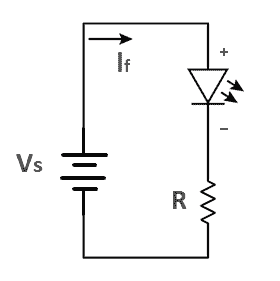

# Introductie

## Hoofdstuk 1 – Wat is een microcontroller?

### 1.1 Wat is een microcontroller?
Een microcontroller is een kleine computer op een chip. Hij kan drie dingen:

- **Meten** (via ingangen of sensoren)
- **Denken** (programma uitvoeren)
- **Sturen** (via uitgangen, bijvoorbeeld een LED of motor aanzetten)

 **Voorbeelden:**

- Raspberry Pi Pico
- Arduino Uno

### 1.2 Verschil met een computer
Een laptop kan veel dingen tegelijk doen (internet, filmpjes, spelletjes).
Een microcontroller doet meestal één taak, maar kan dat heel betrouwbaar en snel.
Bijvoorbeeld: een wasmachine besturen, lampen automatisch schakelen of een robot laten bewegen.

### 1.3 Veilig werken met elektronica
Microcontrollers werken meestal op 3.3V of 5V → veilig voor mensen.

Maar: sluit nooit rechtstreeks een grote motor of lamp aan.

Altijd eerst een weerstand gebruiken bij een LED, anders gaat hij kapot.

---

