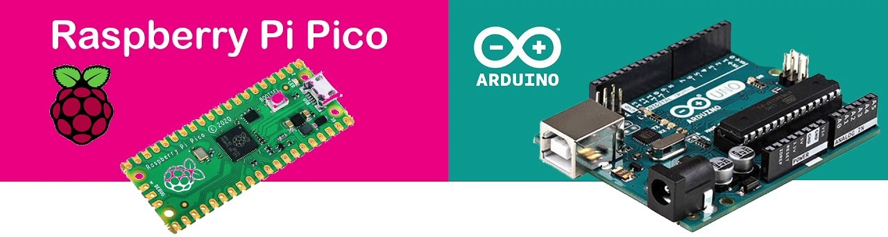
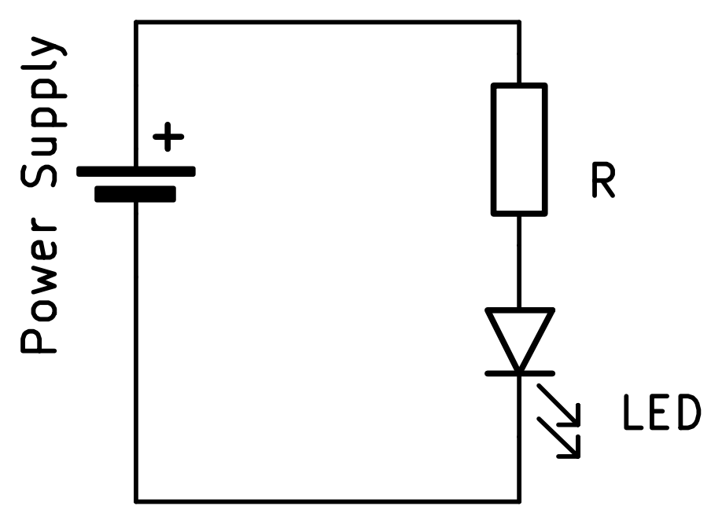

# Introductie

## Hoofdstuk 1 – Wat is een microcontroller?

### 1.1 Wat is een microcontroller?
Een microcontroller is een kleine computer op een chip. Hij kan drie dingen:

- **Meten** (via ingangen of sensoren)
- **Denken** (programma uitvoeren)
- **Sturen** (via uitgangen, bijvoorbeeld een LED of motor aanzetten)

 **Voorbeelden:**

- Raspberry Pi Pico
- Arduino Uno



### 1.2 Verschil met een computer
Een laptop kan veel dingen tegelijk doen (internet, filmpjes, spelletjes).
Een microcontroller doet meestal één taak, maar kan dat heel betrouwbaar en snel.
Bijvoorbeeld: een wasmachine besturen, lampen automatisch schakelen of een robot laten bewegen.

### 1.3 Programmeren

Er zijn vele verschillende mogelijkheden om microtrollers te programmeren. Wij gaan ons beperken tot **C++** en **python**.

Alle **Arduino** borden zijn te programmeren in **C++**. Sommige (de meer krachtige) kunnen ook in **MicroPython** geprogrammeerd worden. Dit is eigenlijk een *light* versie van **python** met enkele bibliotheken die speciaal bedoeld zijn voor microcontrollers. Doorheen de verdere cursus gaan we steeds zowel de code in **C++** als **MicroPython** bespreken. Dit gebeurd in *"code blokken"* zoals hier:

```cpp
// cpp

// Hier staat commentaar in C ++
```

```python
# MicroPython

# Hier staat commentaar in python
```

### 1.4 Veilig werken met elektronica
Microcontrollers werken meestal op 3.3V of 5V. Spanningen tot en met 24V zijn veilig voor mensen.

Dit wil niet zeggen dat mensen veilig zijn voor microcontrollers.
Het vermogen dat een microcontroller bord kan leveren is beperkt. Sluit nooit rechtstreeks een grote motor of lamp aan. Dit kan leiden tot te hoge stromen waardoor de microcontroller of het bord kapot kan gaan.

Zoals in het hoofdstuk over componenten al vermeld werd: altijd een weerstand in serie zetten met een LED, anders kan er iets kapot gaan.



---

