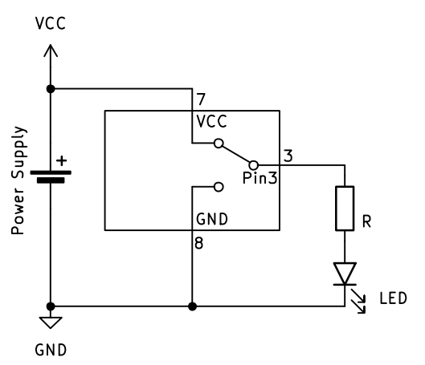
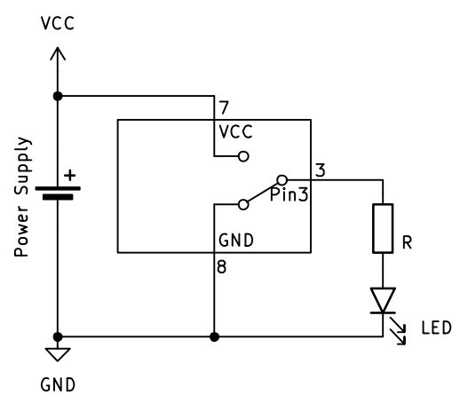
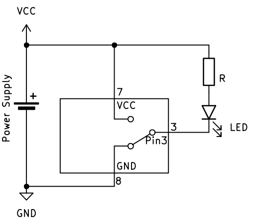
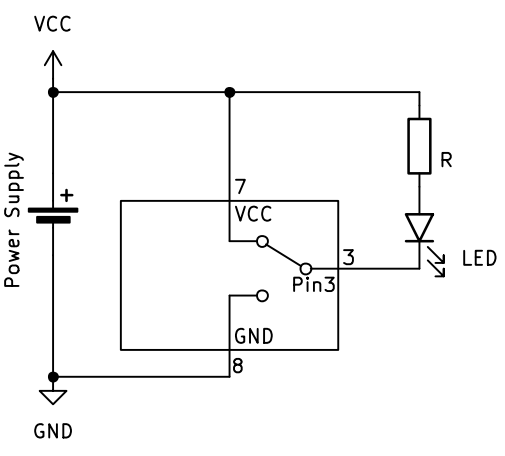

# Output – Dingen aansturen

Output betekent dat de microcontroller iets aanstuurt of laat gebeuren. Dit kan bijvoorbeeld een LED, een motor, een buzzer of een display zijn.

We kunnen dit *voorstellen* door te veronderstellen dat er een SPDT schakelaar in de microcontroller zou zitten die het signaal verbind met de **VCC** (dit is de voedingsspanning, meestal 5V of 3,3V) of met de **GND** (grond, ground of 0V).

**Schema:**


In het bovenstaande voorbeeld zien we dat pin 3 aangesloten is aan een **LED** met een **serie weerstand**. De microcontroller (of het microcontroller bord) is ook aangesloten aan een spanningsbron of voeding. De uitgang op *pin 3* kan verbonden worden met ofwel **VCC** ofwel **GND**. Zoals het in het schema staat, is de uitgang op dit moment verbonden met **VCC** waardoor er stroom door de LED en serieweerstand loopt en de LED licht geeft.

We bekijken nu hoe we, in **C++**, de taal die **Arduino** gebruikt, de uitgang met **VCC** moeten verbinden om de LED te laten branden:

```cpp
// cpp
digitalWrite(3, HIGH); // Pin 3 hoog, LED aan
```
In **MicroPython** ziet het er net iets anders uit. Daar moeten we eerst laten weten dat *led* aan pin 3 aangesloten is. Hoe dat moet, volgt later nog.
```python
# MicroPython
led.value(True); # Uitgang hoog of LED aan
```
of
```python
# MicroPython
led.value(1); # Uitgang hoog of LED aan
```

We kunnen ook de LED uit zetten, zoals aangegeven in dit **schema:**

Er kan nu geen stroom van **+** naar **-** lopen. In de *code* doen we dit zo:
```cpp
// cpp
digitalWrite(3, LOW); // Pin 3 laag, LED uit
```
In **MicroPython** gaat het zo:
```python
# MicroPython
led.value(False); # Uitgang laag of LED uit
```
of
```python
# MicroPython
led.value(0); # Uitgang laag of LED uit
```

In bovenstaande voorbeeld gaat de LED aan als de uitgang ***hoog*** staat en uit als de uitgang ***laag*** staat. Dit noemen we een **actief hoog** signaal.

---

Het is ook mogelijk om de LED (of iets anders) op een andere manier aan te sluiten zodat deze licht geeft (of actief is) wanneer de uitgang ***laag*** staat. Dit noemen we een **actief laag** signaal.

**Schema:**


Dit schema en de werking zijn nagenoeg hetzelfde maar de LED en de serieweerstand zijn aan **VCC** aangesloten in plaats van aan **GND**. Dit wil zeggen dat de LED nu zal licht geven wanneer de uitgang van de microcontroller met **GND** verbonden is en zal uit zijn wanneer hij met **VCC** verbonden is.

Nu moeten we in de code (**C++** of **MicroPython**) de uitgang dus ***laag*** zetten om actief te zijn. Dit gebeurt met dezelfde code als hierboven om de uitgang *laag* te zetten:
```cpp
// cpp
digitalWrite(3, LOW); // Pin 3 laag, LED aan
```
In **MicroPython** gaat het zo:
```python
# MicroPython
led.value(False); # Uitgang laag of LED aan
```
of
```python
# MicroPython
led.value(0); # Uitgang laag of LED aan
```

Om de LED uit te zetten, moeten we in dit geval de uitgang ***hoog*** zetten:

**Schema:**

```cpp
// cpp
digitalWrite(3, HIGH); // Pin 3 hoog, LED uit
```
In **MicroPython** gaat het zo:
```python
# MicroPython
led.value(True); # Uitgang hoog of LED uit
```
of
```python
# MicroPython
led.value(1); # Uitgang hoog of LED uit
```

Een **1** of een **0**, **HIGH** of **LOW**, **True** of **False** hebben in beide schema's dus een andere uitwerking. Het is belangrijk om hiermee rekening te houden!
